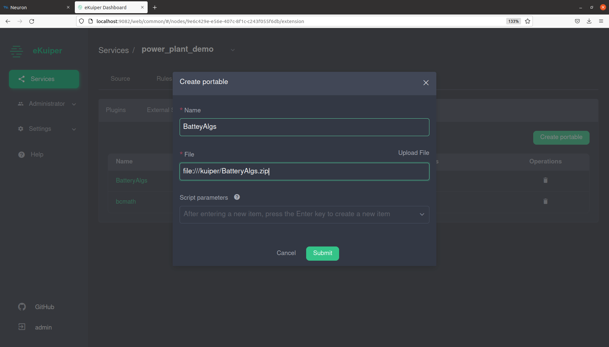

# Overview
Power Plant monitoring with EMQ and Edge Insights for Industrial use case delivers a front to end solution of time series data collecting, distributing, processing, monitoring, and storage. It is a typical use case in the industrial environment where many industrial sensors, PLCs generating time series data in different protocols, industrial gateway software Neuron can parse these protocols. Rules engine, eKuiper, can set filters, algorithms to the data stream.  MQTT message broker, EMQX, provides high available, high performance messaging service. The data then flows into the TICK stack of Intel EII for data storage and monitoring.  
 
# Target System Requirements 
**Minimum System Requirements:**
* 8th generation onwards with Intel® Atom™ processors, Intel® Core™ processors, or Intel®   Xeon™ processors.
* At least 4 GB RAM.  
* At least 128 GB hard drive.  
* An Internet connection.  
* Ubuntu 20.04

# How It Works 
Edge Insights for Industrial uses the TICK stack for time-series data analytics. Telegraf, InfluxDB and Grafana are parts of the TICK stack of Intel® EII. In this usecase, industrial protocol gateway software Neuron, rules engine eKuiper and MQTT message broker EMQX can ingest various industrial data before Telegraf in the TICK stack.
The high-level flow of data is as follows: Modbus Simulator -> Neuron -> eKuiper -> EMQX -> Telegraf -> InfluxDB -> Grafana 
* Modbus Simulator generates power plant's time series data in Modbus TCP. 
* Neuron parses Modbus TCP data. 
* eKuiper processes the data stream by adding rules and algorithms. 
* EMQ X republishes the message in the MQTT protocol in Pub/Sub mode. 
* Telegraf is configured to input MQTT and subscribes data from EMQ X. 
* InfluxDB is connected to Telegraf to store the data. 
* Grafana is used for data visualization and monitoring.
When using EMQ IoT messaging software with Intel® EII, all the modules are running on the same node.


# Get Started 
**Prerequisites** 
Follow the steps in [Open Edge Insights installation guide](https://open-edge-insights.github.io/pages/running.html#install-open-edge-insights-for-industrial-from-github), Task1 to get the Open EII 3.0 codebase, and Task2 to install prerequisites.

## Step 1: Run EII Time Series with EMQ

1. Generate EII time series deployment and configuration files: 
    ```sh
    cd [WORK_DIR]/IEdgeInsights/build
    python3 builder.py -f usecases/time-series.yml
    ```
    If this is first time you run this, you need to set ETCDROOT_PASSWORD, INFLUXDB_USERNAME, and INFLUXDB_PASSWORD in [WORK_DIR]/IEdgeInsights/build/.env. For example, ETCDROOT_PASSWORD='intel'

2. Build ia_telegraf with new config:
    Replace [WORK_DIR]/IEdgeInsights/Telegraf/config/Telegraf/Telegraf.conf with github link, MQTT input plugin is configured.
    ```sh
    cd [WORK_DIR]/IEdgeInsights/build
    docker-compose -f docker-compose-build.yml build --no-cache ia_telegraf
    ```
    If any of the services fails during the build, then run the following command to build the service again:
    ```sh
    docker-compose -f docker-compose-build.yml build --no-cache <service name>
    ```

3. Get docker-compose.yml with EMQ software from [docker-compose.yml](docker-compose.yml), and replace [WORK_DIR]/IEdgeInsights/build/docker-compose.yml with the new one.
4. Start EII time series use case with EMQX:
    ```sh
    cd [WORK_DIR]/IEdgeInsights/build
    ./eii_start.sh
    ```

5. Check if all the services are up:
    ```sh
    docker ps
    ```
    
6. Start [power_plant_modbus_simulator.py](power_plant_modbus_simulator.py):
    ```sh
    sudo pip3 install pymodbus==2.5.3
    sudo python3 ./power_plant_modbus_simulator.py
    ```

## Step 2: Configure Neuron 
1. Login to Neuron web console at http://localhost:7000, username/password: admin/0000

2. Add a south device named battery and a modbus-tcp plugin.
    

3. Click on Device configuration on the battery tab to add configuration, please change the IP address to your host IP.
    

4. Click on the battery tab to add a group, import predefined list from [upload-tag-template.xlsx](upload-tag-template.xlsx).
    

5. Click on the data-stream-processing tab in North application, add subscription to south device battery. 
    

## Step 3: Configure eKuiper 
1. Install dependencies in the container.
    ```sh
    sudo docker exec -it ekuiper /bin/bash 
    pip install numpy==1.22.3 -i http://pypi.douban.com/simple/ --trusted-host pypi.douban.com 
    pip install scipy==1.8.0 -i http://pypi.douban.com/simple/ --trusted-host pypi.douban.com
    ```
2. Download plugin from [bcmath.zip](bcmath.zip) [BatteryAlgs.zip](BatteryAlgs.zip), copy them from host to the container.
    ```sh
    sudo docker cp ./bcmath.zip ekuiper:/kuiper/bcmath.zip 
    sudo docker cp ./BatteryAlgs.zip ekuiper:/kuiper/BatteryAlgs.zip
    ```
3. Login to ekuiper web console at http://localhost:9082, username/password: admin/public

4. Add Service power_plant_demo, use your host IP for Endpoint.
    
 
5. Click on service(power_plant_demo)->Extension->Portable->Create portable, add portable BatteryAlgs and bcmath.  
    ```
    file:///kuiper/bcmath.zip 
    file:///kuiper/BatteryAlgs.zip
    ```
    
    

 
6. Add Streams: NeuronStream, dt1Stream
    
    
 
7. Add the following rules, go to [eKuiper_rules.md](ekuiper_rules.md) to find details.
    
 
## Step 4: Configure EMQX 
1. Login to EMQX web console at http://localhost:18083, username/password: admin/public.

2. Add the following rules, go to [emqx_rules.md](emqx_rules.md) to find details.
    
 
## Step 5: Configure Grafana
1. Login to Grafana web console at https://localhost:3000, username/password: admin/admin.

2. Import dashboard, you can get pre-defined demo dashboard from [grafana_dashboard.json](grafana_dashboard.json):
    

3. View Data in the demo dashboard.
    

# Summary and Next Steps 
This demo showcases the typical workflow and usage of time series data in the industrial solution.  As a next step, we can add more rules and algorithms, such as anomaly detection in eKuiper, add more industrial protocols in Neuron, to explore more capability of this reference software solution. 

# Learn More 
To continue learning, see the following guides and software resources: 
* [EMQ X GitHub](https://github.com/emqx/emqx)
* [Neuron GitHub](https://github.com/emqx/neuron)
* [LF eKuiper GitHub](https://github.com/lf-edge/ekuiper)
* [EMQ X documentation](https://www.emqx.io/docs/en/v4.3/)
* [Neuron Documentation](https://docs.emqx.io/en/neuron/latest/)
* [LF eKuiper Documentation](https://ekuiper.org/docs/en/latest/)

# Troubleshooting 
1. To check if the connections of the Modbus simulator and eKuiper are healthy, find the connection status in neuron's web console.
    
    
2. Monitor the data of south device.
    
3. Check eKuiper rule status to find out rule execution status of each step. You can open the status window by click on the status icon of each rule.
     
4. Use websocket tool in EMQX to subscribe to a topic and to receive messages in real time.
    
     
5. Print the logs of ia_influxdbconnector.
    ```sh
    docker logs ia_influxdbconnector
    ```
    


